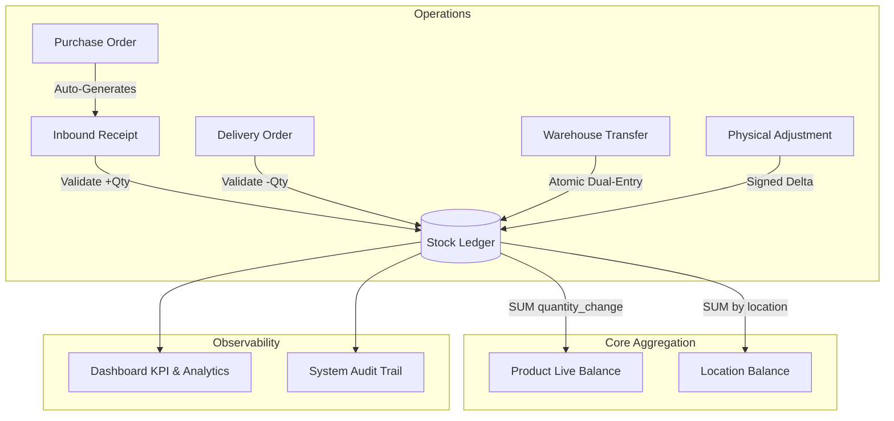

# CoreInventory — Enterprise Inventory Management System (IMS)

An enterprise-grade, multi-warehouse Inventory Management System built with **Laravel 11**, designed around an **immutable, append-only stock ledger** architecture rather than static counter columns. This design guarantees complete auditability, prevents race conditions, and eliminates phantom stock across concurrent warehouse operations.

---

## Key Architectural Principles

### 1. Immutable Stock Ledger (Double-Entry Inventory Accounting)
Unlike conventional inventory systems that execute `UPDATE products SET quantity = quantity - X`, CoreInventory maintains an append-only `stock_ledger` table.
- **Dynamic Aggregate Valuation**: Product stock is calculated on demand via Eloquent accessors:
  $$\text{Current Stock} = \sum(\text{quantity\_change})$$
- **Audit Trails**: Every movement references a source document (`Receipt`, `Delivery`, `Transfer`, or `Adjustment`) via polymorphic relations.

### 2. ACID Transaction Boundaries
All stock movements are wrapped inside database transactions (`DB::transaction`). If any stage fails—such as insufficient stock during dispatch—the entire operation is rolled back, guaranteeing zero partial writes.

### 3. Dual-Entry Inter-Warehouse Transfers
Transfers between locations post two balanced ledger entries atomically:
- A negative quantity change at the origin location.
- A positive quantity change at the destination location.

### 4. Physical Count Discrepancy Reconciliation
Physical cycle counts calculate signed deltas:
$$\Delta_{\text{quantity}} = \text{physical\_count} - \text{recorded\_stock}$$
The signed delta is committed to the ledger, synchronizing system records with reality without destroying historical audit trails.

### 5. Document Workflow State Machines
Documents (`Receipts`, `Deliveries`, `Transfers`, `Purchase Orders`, `Adjustments`) follow a strict state lifecycle (`Draft` &rarr; `Done` / `Approved` / `Cancelled`). Once marked `Done`, documents are locked against post-validation edits or deletion.

### 6. Automated Procurement Lifecycle
Approving a Vendor Purchase Order automatically provisions a draft Inbound Receipt with linked line items and updates product cost pricing to reflect agreed vendor terms.

---

## Core Features

- **Multi-Warehouse & Location Topology**: Model complex warehouse structures with dedicated zones, shelves, and bins.
- **Automated Low-Stock Thresholds**: Real-time SQL aggregation detecting products breaching safety levels with one-click reorder PO generation.
- **Barcode & QR Code Generation**: On-the-fly Code-128 barcodes and 2D QR codes for product labeling and inventory scanning.
- **Automated PDF Documents**: High-resolution, printable PDF Inbound Receipts and Outbound Delivery Packing Slips powered by DomPDF.
- **Role-Based Access Control (RBAC)**: Custom middleware enforcing permissions across three distinct tiers:
  - `admin`: Full administrative access, company settings, warehouse topology, user administration, and soft-delete/purge operations.
  - `manager`: Full operational lifecycle (create, edit, approve, and validate documents).
  - `staff`: Read-only access to catalogs, stock ledgers, and draft document creation.
- **Comprehensive Activity Logging**: Full chronological tracking of model events and system modifications using Spatie Activitylog.
- **Data Exporting**: One-click Excel and CSV exports for products, inventory transactions, and vendor directories.

---

## System Architecture



---

## Tech Stack

- **Backend Framework**: Laravel 11.x (PHP 8.2+)
- **Database**: MySQL / MariaDB (Supports PostgreSQL and SQLite)
- **Frontend / Templating**: Laravel Blade, Vanilla CSS (Glassmorphism design tokens), Vite
- **Document & Label Generation**:
  - `barryvdh/laravel-dompdf`: Automated PDF generation for packing slips & receipts
  - `picqer/php-barcode-generator`: Code-128 barcode generation
  - `bacon/bacon-qr-code`: SVG/PNG QR code generation
- **Audit & Exporting**:
  - `spatie/laravel-activitylog`: Complete system activity timeline
  - `maatwebsite/excel`: Excel and CSV report exports

---

## Installation & Local Setup

### Prerequisites
- PHP >= 8.2 with `pdo`, `pdo_mysql`, `gd`, `bcmath`, `mbstring`, `xml` extensions
- Composer 2.x
- MySQL 8.0+ or MariaDB 10.4+
- Node.js & npm (for asset compilation)

### Setup Steps

1. **Clone the repository**:
   ```bash
   git clone https://github.com/yashpadaliya08/CoreInventory-IMS.git
   cd CoreInventory-IMS
   ```

2. **Install PHP dependencies**:
   ```bash
   composer install
   ```

3. **Configure environment**:
   ```bash
   cp .env.example .env
   php artisan key:generate
   ```

4. **Update database credentials in `.env`**:
   ```env
   DB_CONNECTION=mysql
   DB_HOST=127.0.0.1
   DB_PORT=3306
   DB_DATABASE=coreinventory
   DB_USERNAME=root
   DB_PASSWORD=
   ```

5. **Run database migrations and seeders**:
   ```bash
   php artisan migrate --seed
   ```

6. **Create storage symlink**:
   ```bash
   php artisan storage:link
   ```

7. **Install and build frontend assets**:
   ```bash
   npm install
   npm run build
   ```

8. **Start the development server**:
   ```bash
   php artisan serve
   ```
   Access the application at: `http://127.0.0.1:8000`

---

## Demo Credentials

The database seeder provisions initial test accounts with the following roles:

| Role | Email | Password | Permissions Scope |
| :--- | :--- | :--- | :--- |
| **Admin** | `admin@coreinventory.local` | `Admin@12345` | Unrestricted CRUD, Settings, Users, Purges |
| **Manager** | `manager@coreinventory.local` | `Manager@12345` | Document validation, inventory operations, procurement |
| **Staff** | `staff@coreinventory.local` | `Staff@12345` | Read-only catalogs, draft creation |

---

## License

This project is licensed under the [MIT License](LICENSE).
